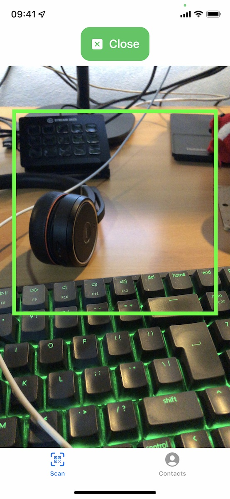
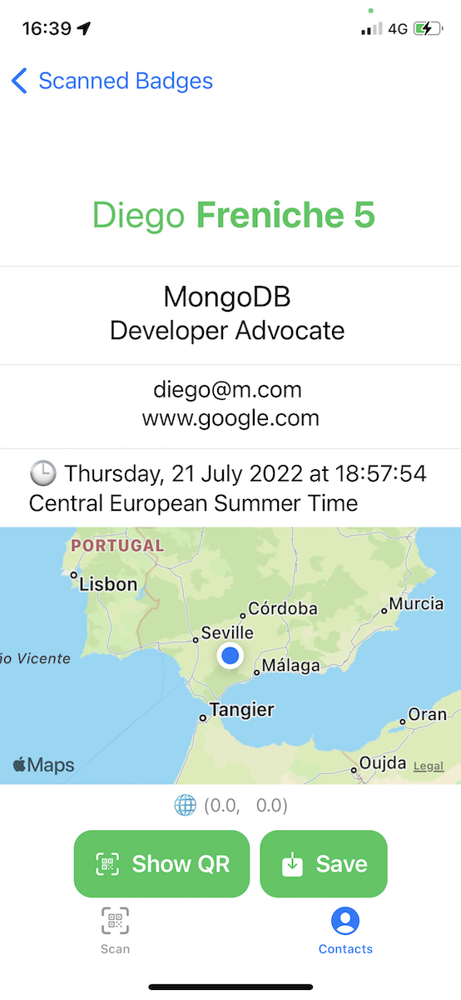

# MongoDBooth

_Was going to call it Booty McBooth, but..._

|    Scan    | Data     | 
| :------------: | :----------: | 
|   |    | 

## What?

This is a QR-code scanning App for iOS devices. Allows you to scan a QR code, then analyzes that QR code and extract relevant fields from it if contains data that's [VCard v3](https://www.evenx.com/vcard-3-0-format-specification) compliant. This data, alongside position (Latitude and Longitude) and time are then stored in a [MongoDB Atlas Database](https://www.mongodb.com/) using the [Realm Swift SDK](https://www.mongodb.com/docs/realm/sdk/swift/) and [Atlas Device Sync](https://www.mongodb.com/docs/atlas/app-services/sync/learn/overview/). 

The raw text string stored in the QR code is always stored just in case.

## How?

It's written in Swift / SwiftUI (and a bit of UIKit). Should compile with Xcode 14.

## Why?

As a Developer Advocate we spend some time in the company's booth, speaking to developers. One of our tasks if to scan all people engaging with us at the booth, and these days most conferences include QR codes in their conference badges. But:
- sometimes the conference App doesn't work
- it needs an online connection, but conference Wifi is.never.good.enough.
- there's no scanning app
- scanning phones stopped working

So I decided to build this little app that will allow us to put all this valuable data in a MongoDB Atlas instance, so we can create charts, analyze traffic to the Booth, etc.  

## Bugs

If you find bugs just drop an issue 👍

## License

[Apache 2, see LICENSE file](LICENSE)
